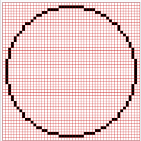

# IMPORTANT ALGORITHMS

## Circle Draw
> Midpoint Circle Algorithm
- [Bresenhams algorithm](https://www.geeksforgeeks.org/bresenhams-circle-drawing-algorithm/)

Algorithm for drawing a pixel circle give center position and radius



## Perlin Noise Algorithm
Algorithm for generating a random terrain

## Physic Engine
### Game Terrain
```go
map := [screenX][screenY]bool // 640 x 320 map
```
### Game Object
```go
// Every game object must include these method
type GameObject interface {
    Update(elapsed float64) // elaped time between each loop
    Render() // draw the object to game screen base on it properties
}

type ObjectStatus
const (
    Idle ObjecStatus = ioat
    Runing
    Dead
)
// Example
type Object interface {
    posX int
    posY int
    veloX int
    veloY int
    radius int
    sprite ebiten.Image
    status ObjectStatus
    isMoving bool
}

func (ob *Object) Update (elapsed float64) {
    if ob.status == Dead {
        return
    }
    // Update new position base on velocity and elapsed time
    ob.posX = ob.posX + ob.veloX*elapsed
    ob.posY = ob.posY + ob.veloY*elapsed
}


func (ob *Object) Render () {
    ebiten.DrawRect(
        posX + sprite.width/2,
        posY + sprite.height/2, sprite
    ) // Pseudo code
}

```